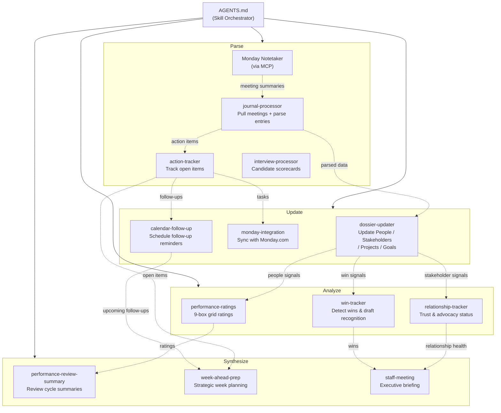
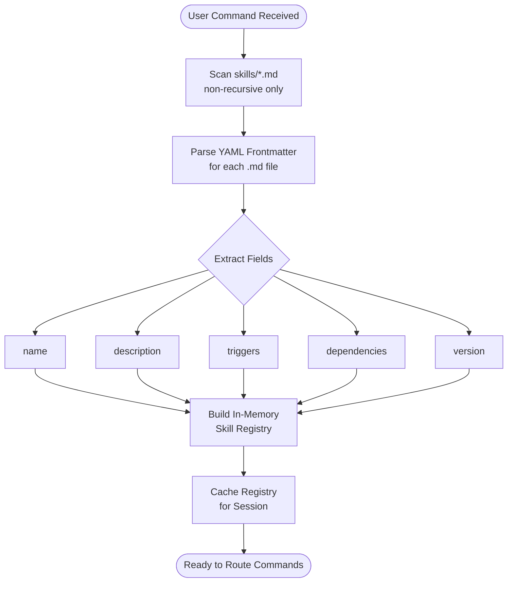
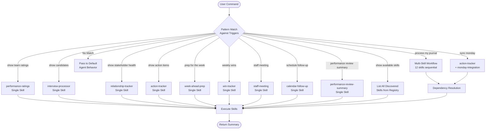
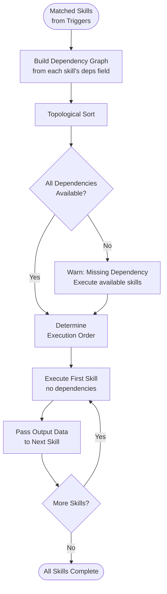
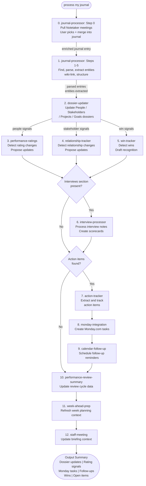
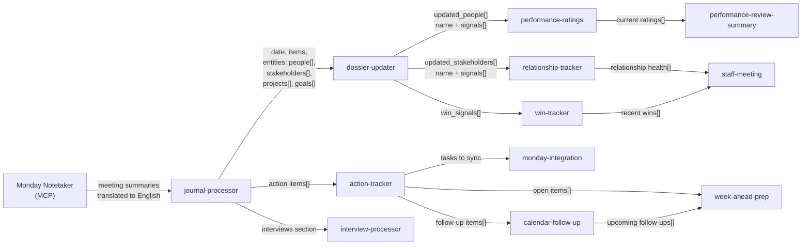
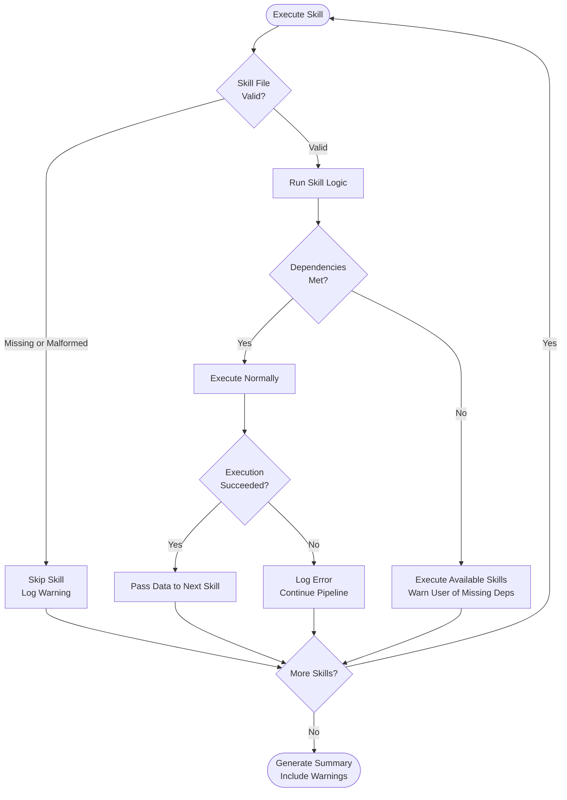
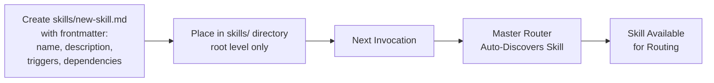

# Daily Journal Master Router - Functional Flowcharts

Visual reference for the modular journal processing system defined in `AGENTS.md`.

---

## 1. System Architecture

The master router (`AGENTS.md`) discovers and orchestrates 12 modular skills organized into four tiers. The journal-processor pulls meeting summaries from Monday Notetaker (via MCP) as its first step.



---

## 2. Skill Discovery Process

On every invocation the router dynamically discovers available skills. No hardcoded skill list.



---

## 3. Command Routing Logic

User commands are matched against skill triggers. Some commands invoke a single skill; others trigger multi-skill workflows.



---

## 4. Dependency Resolution Flow

For multi-skill workflows, a topological sort determines execution order so data flows correctly between skills.



---

## 5. Full Journal Processing Workflow

End-to-end flow when the user says **"process my journal"** -- the most complex multi-skill workflow.



---

## 6. Data Flow Between Skills

Structured JSON objects are passed between skills. This diagram shows the data contracts.



### Data Contracts Detail

**journal-processor output:**
```json
{
  "date": "2026-01-25",
  "items": ["...parsed entries..."],
  "entities": {
    "people": ["Sarah", "..."],
    "stakeholders": ["Mike", "..."],
    "projects": ["ProjectX", "..."],
    "goals": ["Q1 OKR", "..."]
  }
}
```

**dossier-updater to performance-ratings:**
```json
{
  "updated_people": [
    { "name": "Sarah", "signals": ["shipped ahead of schedule"] }
  ]
}
```

**dossier-updater to relationship-tracker:**
```json
{
  "updated_stakeholders": [
    { "name": "Mike", "signals": ["excluded from meeting"] }
  ]
}
```

**dossier-updater to win-tracker:**
```json
{
  "win_signals": [
    { "person": "Sarah", "signal": "shipped ahead of schedule", "date": "2026-01-25" }
  ]
}
```

**action-tracker to calendar-follow-up:**
```json
{
  "follow_up_items": [
    { "person": "Mike", "topic": "Alignment check", "suggested_date": "2026-01-28" }
  ]
}
```

---

## Error Handling Flow

How the system handles failures gracefully without halting the entire pipeline.



---

## Adding New Skills

New skills are auto-discovered. No changes to the master router required.


